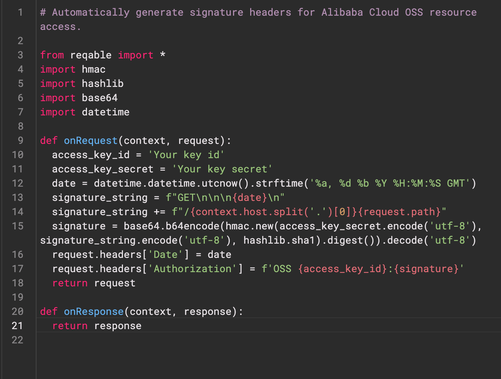

# Re-Highlight

[](https://pub.dev/packages/re_highlight)

[中文版本](./README_CN.md)

`Re-Highlight` is a powerful syntax highlighter, which is a sub-module of the [Reqable](https://reqable.com) project. `Re-Highlight` can highlight a text by simply defining a syntax file. And `Re-Highlight` has built-in syntax highlighting rules for dozens of programming languages, it is easy to make your text syntax highlighting in just a few lines of code.

The implementation code of `Re-Highlight` is all written in the `Dart`, translated from the [highlightjs](https://github.com/highlightjs/highlight.js) project. The implementation idea and inspiration of `Re-Highlight` come from the [highlight.dart](https://github.com/git-touch/highlight.dart) project. We are grateful for these great open-source projects. Due to some issues with the `highlight.dart` project and its discontinuation, this project was born.

👏👏👏 `Re-Highlight` has been synchronized with the latest version v11.9.0 of `highlightjs` and has passed all test cases.

The below shows the highlighting effect. For more styles and languages, please refer to example.



## Getting Started

Add the followings in `pubspec.yaml`.

```yaml
dependencies:
  re_highlight: ^0.0.3
```

Highlight yout text or code.

```dart
final Highlight highlight = Highlight();
highlight.registerLanguages(builtinAllLanguages);

const languages = [
  'json',
  'python',
  // other language
];

// Highlight your text or code.
final HighlightResult result = _highlight.highlightAuto('Your text or code', languages);

// Define your styles.
final TextStyle defaultStyle = TextStyle();
final Map<String, TextStyle> yourTheme = rainbowTheme;

// Convert highlight result to TextSpan
final TextSpanRenderer renderer = TextSpanRenderer(defaultStyle, yourTheme);
result.render(renderer);
final TextSpan? span = renderer.span;

// Pass the span to your Text Widget or TextEditingController.
```

More codes please see `example`.

## Principle and Build

The `Re-Highlight` project is divided into three parts: syntax highlighting rule interpreter, syntax highlighting rule files, and theme style files. The rule interpreter is located in the `src` directory, the syntax highlighting rule files are located in the `lib\languages` directory, and the theme style files are located in the `lib\styles` directory. The latter two are automatically generated based on the files in highlightjs and do not require manual modification.

- Install `gulp`.

```
npm install gulp -g
```

- Sync `highlightjs` modules.

```
git submodule update --remote --init
```

- Auto generated rule files.

```
cd tool
npm install
gulp generate
```

- Run unit-tests.

```
flutter test
```

The code in the syntax highlighting rule interpreter part is translated directly from `highlightjs`, and we have tried to keep the consistency of file structure, class names, function names, and code logic as much as possible to facilitate future upgrades and synchronization.

## Used By

- [re-editor](https://github.com/reqable/re-editor) A powerful lightweight text and code editor widget.

## Issues and Features

The syntax and logic of `Re-Highlight` are strictly translated from the `highlightjs` project. If you find any syntax issues or need support for new languages, we suggest submitting them to [highlightjs](https://github.com/highlightjs/highlight.js), and we will try to synchronize them as soon as possible.

If it's related to `Dart` or `Flutter`, it is welcome to submit an issue or PR in this project.

## Sponsor

If you would like to sponsor this project, please consider sponsoring the `highlightjs` project first. If you still have the capacity, you can support us by purchasing a [Reqable](https://reqable.com/pricing) license.